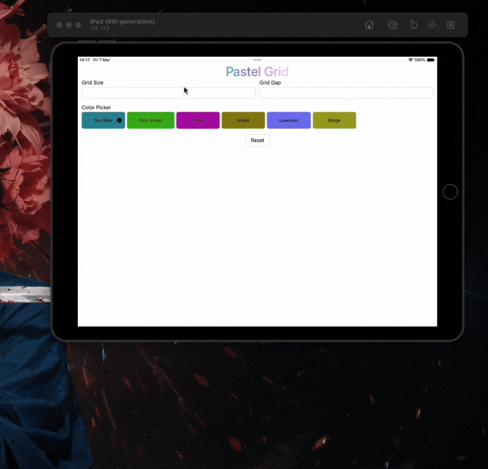
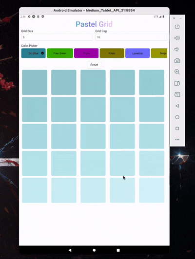
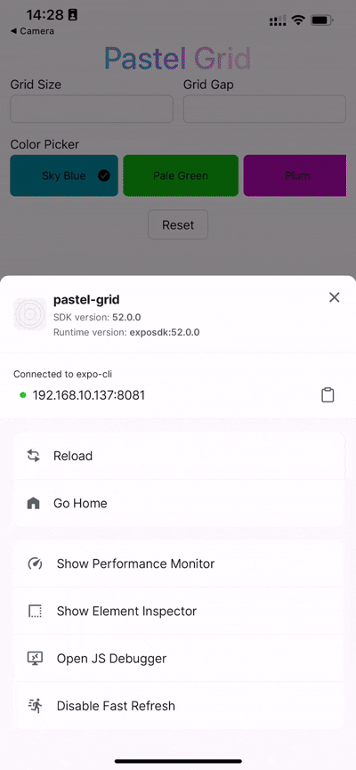
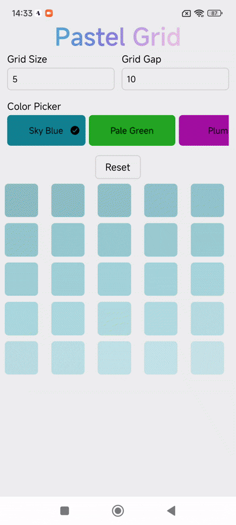

# Interview Pastel Grid

Interview Pastel Grid is an application developed using Expo and React Native, supporting drag-and-drop elements in a grid layout.

# Demo

<div style="white-space: nowrap;">
  
  
</div>
  <div style="white-space: nowrap;">
  
  
</div>

## 🚀 Technologies Used

- **React Native**: 0.76.7
- **Expo**: 52.0.37
- **React**: 18.3.1
- **TypeScript**
- **react-native-sortables**: 1.3.2
- **@testing-library/react-native**: 13.1.0
- **tinycolor2**: "1.6.0"

## 📦 Installation

⚠️ Note: This project requires **Node.js 20** or later and **Java 17**. Please ensure you have the correct versions installed before proceeding.

Make sure you have **Node.js** and **Expo** installed.

### 1. Clone the repository

```sh
git clone https://github.com/perryhoang2012/interview-pastel-grid.git
cd interview-pastel-grid
```

### 2. Install dependencies

```sh
yarn
```

or

```sh
npm install
```

## ▶️ Run the Application

### 1. Run on a device or emulator

```sh
yarn start
```

or

```sh
npm start
```

### 2. Run on a device or emulator (iOS)

```sh
yarn ios
```

or

```sh
npm run ios
```

### 3. Run on a device or emulator (Android)

```
yarn android
```

or

```
npm run android
```

### 4. Run with prebuild (iOS & Android folders required)

If you want to run the application in prebuild mode with native iOS and Android folders, switch to the appropriate branch:

```
git checkout feature/prebuild
```

Then, install dependencies and run:

```
expo prebuild
```

Finally, run the app:

```
yarn android
```

or

```
yarn ios
```

⚠️ Note: Running with prebuild will take longer and consume more time during the first run.

#### Then, scan the QR code using Expo Go (iOS/Android) or choose to run on an emulator.

## 🛠 Key Features

- Drag and drop elements in a grid using **react-native-drag-sort**
- Implemented a function to **generate random color palettes**
- Write tests using **@testing-library/react-native**

## 🧪 Run Tests

```sh
yarn test
```

or

```sh
npm test
```

## 💡 Challenges Faced

During development, we encountered several challenges when searching for a flexible list interface that supports a dynamic grid layout:

**FlatList**: Not **flexible** enough for a dynamic grid layout.

**ScrollView**: Allowed flexible layouts but **lacked drag-and-drop functionality**.

**react-native-draggable-gridview**: Had drag-and-drop support but did **not scroll** properly and has not been actively maintained.

**react-native-drag-sort**: **Provided smooth** drag-and-drop functionality but caused FPS to drop to 25.

**react-native-sortables**: **Performed well**, maintaining smooth drag-and-drop functionality with a **minimum FPS** of 35.

**Implemented a function to generate a random color palette dynamically**.

**Calculating item sizes for different screen types to ensure a consistent and responsive layout across devices.**

## 📝 Notes

- Make sure you have **Expo Go** installed on your mobile device to run the app.
- If you encounter issues, check your **Node.js** and **Expo CLI** versions.

💡 **If you have any questions or need support, feel free to open an issue on GitHub or contact me!**
